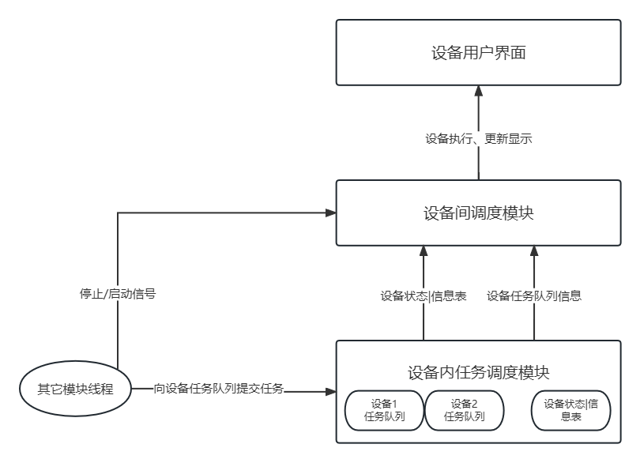

## 设备管理模块

###### 代码GitHub仓库地址: [xyt417/qtemu (github.com)](https://github.com/xyt417/qtemu)

### 设备管理模块架构



### 项目文件结构

```c++
文件结构：

Source文件夹：源码存放文件

Source/release: 编译输出文件
    
Source/release/Disk：模拟磁盘文件

Source：

- device.h: 设备信息表类 和 设备队列类 设备任务管理调度

- deviceWidget.h: 设备间调度处理模块 及 设备管理窗口和设备窗口

- MyThread.h: 测试用的线程类

- test_device: 设备信息表类 和 设备队列类 单元测试

- test_deviceWidget.cpp: 设备管理模块 模块测试

- DeviceModuleTest.exe： 设备管理模块测试 二进制可运行
```

### 设备用户界面

图为模块测试运行截图


### 接口调用说明

接下来说明设备管理模块的接口及使用方法：

```
// 首先在主程序main中应该创建一个设备信息表并添加设备，如：
// 设备种类有显示器screen,打印机printer,磁盘disk
// add_device(string 设备名字(随意，认得出就行), 设备种类(以上三种之一), 设备优先级(默认为0,数字越大优先级越高))
    DeviceTable deviceTable;
    deviceTable.add_device("screen1", "screen", 1);
    deviceTable.add_device("printer1", "printer");
    deviceTable.add_device("printer2", "printer");
    deviceTable.add_device("printer3", "printer");
    deviceTable.add_device("disk1", "disk");
// 磁盘设备就创建一个就行
// 然后使用该设备信息表初始化一个设备任务队列
 DeviceQueue deviceQueue(deviceTable);
// 然后创建设备管理主窗口，并令其显示 参数(设备信息表，设备队列，是否在命令行输出日志(1为是,0为否))
    DeviceMainWindow deviceMainWindow(deviceTable, deviceQueue, 1);
    deviceMainWindow.show();
```

初始化完成后就可以在其他线程中使用设备管理模块了

这里创建了一个线程，并在该线程中调用使用为例：

```
class TestThread : public QThread {
    Q_OBJECT //使用Q_OBJECT 从而能够使用Qt信号与槽通信
private:
    DeviceQueue &deviceQueue;
    DeviceMainWindow &deviceMainWindow;
signals: // 定义两个信号用于启动设备处理，和停止设备处理
    void startSignal();
    void stopSignal();
public:
     MyThread(DeviceQueue &deviceQueue, DeviceMainWindow &deviceMainWindow) : deviceQueue(deviceQueue), deviceMainWindow(deviceMainWindow) {
         // 将该信号连接到deviceMainWindow的start()和stop函数
        connect(this, SIGNAL(startSignal()), &deviceMainWindow, SLOT(start()));
        connect(this, SIGNAL(stopSignal()), &deviceMainWindow, SLOT(stop()));
    }
    void run() override {
        emit stopSignal(); // emit该信号即可时设备处理程序暂停
        emit startSignal();  // 或启动
        // 不需要可以不用，设备处理程序默认启动
        
        // 接口:
        // deviceQueue.allocate_device(string设备种类，string进程名称, string任务信息，int任务在该设备队列中的优先级【且数字越大优先级越高】)
        // 目前支持的任务种类: print任务(只支持 显示器screen，和打印机printer)、read/write任务(只支持 磁盘disk)
        // 任务信息中参数以逗号分隔，磁盘块号范围为0~99，共100个磁盘块
        // print任务:"print,text(要打印的字符串)"
        // write任务:"write,磁盘快号,距磁盘块首部偏移字节数,text(写入的字符串)"
        // read任务:"read,磁盘快号,距磁盘块首部偏移字节数,读取长度,读取到目标buffer号(1~999)"
        // 示例:
        	// 打印到打印机
            deviceQueue.allocate_device("printer", "p1", "print,p1: hello printer i'm p1");
            deviceQueue.allocate_device("printer", "p2", "print,p2: hello printer i'm p2");
        	// 打印到显示器
            deviceQueue.allocate_device("screen", "p3", "print,p3: hello printer i'm p3", 2);
        	// 读取和写入
            deviceQueue.allocate_device("disk", "p0", "write,0,10,hello disk0.");
        	deviceQueue.allocate_device("disk", "p1", "read,0,10,12,0");
			// 查看读取到的数据
        	if(!deviceQueue.readInBuffer[0].empty())
        		cout << deviceQueue.readInBuffer[0]; // index 为 0~999
       // 如果确定要分配的设备名字，要将任务分配给该指定设备:
       // 使用：deviceQueue._allocate(string设备名, string进程名称, string任务信息, int任务在该设备队列中的优先级【且数字越大优先级越高】)
        // 示例:
        	deviceQueue._allocate_device("HuaWeiPrinter", "p1", "print,p1: hello HuaWeiPrinter");
    }
}
```

### 主要数据结构概览

##### 设备任务队列

```c++
class DeviceQueue {
private:
    DeviceTable &deviceTable;                           // 设备信息表

    vector<string> devices;                             // 设备名列表
    vector<string> types;                               // 设备类型列表
    vector<string> available_devices;                   // 空闲设备列表
    map<string, vector<DevRequest>> occupied_devices;   // 正在使用的设备字典，键为设备名，值为使用该设备的进程列表
    
    // 主要方法：
    // 分配给具体设备任务
    bool _allocate_device(string device_name, string process_name, string request, int priority = 0);
    // 分配给某一特定类型设备任务
    bool allocate_device(string device_type, string process_name, string request = "", int priority = 0);
    // 确认执行完某一任务，释放设备并将其移出任务队列
    bool release_device(string device_name, string &process_name);
    
}
```

##### 设备信息表

```c++
class DeviceTable {
private:
    int devNum;				   // 设备数量
    vector<Device> deviceList;	// 设备列表
    
    // 主要方法:
    // 添加设备
    bool add_device(string name, string type, int priority = 0);
    // 删除设备
    bool remove_device(string name)；
    // 更新设备状态
    bool change_device_status(string name, int status, string pname);
}
```

##### 任务请求

```c++
struct DevRequest {
    string pname;       // 进程名
    string requestStr;  // 任务请求信息
    int priority;       // 任务优先级
};
```

##### 设备信息块

```c++
struct Device {
    string name;	// 设备名
    string type;	// 设备类型
    int status;		// 设备状态
    string pname;   // 占用或将占用的进程
    int priority;   // 设备优先级
};
```

### 设备调度算法说明

#### 设备间调度

设备处理模块每一个处理周期处理一个设备任务队列中的一个任务。

###### 相同优先级设备

以相同优先级的设备视角来看，设备处理模块在属于该优先级设备的处理周期依次遍历每一个同优先级的设备，实现同优先级设备分配相同的处理资源

###### 不同优先级设备

每一个设备拥有一个整形变量表示优先级，数字最小为0(默认值)，数字越大优先级越高。对于设备优先级为x的设备集合，该集合所有设备在所有更低优先级设备处理完任务或用尽它们的周期之前，获得的处理周期数不超过2^x个周期。当该集合设备任务为空或连续获得的处理周期数达到2^x个周期时，模块将优先处理还未使用完分配周期数的更低优先级的设备集合。在高优先级设备获得的处理周期数用完之前，接到任务时还可以抢占接下来的处理周期，否则不能抢占。当所有优先级设备集合都用尽分配周期或任务为空时将重新分配处理周期。


通过该调度方法，可以实现相同优先级设备获得相同处理资源，优先级更高设备获得更多处理资源，同时低优先级设备不会因得不到处理资源而饿死。


#### 设备内任务调度

设备内任务队列在该设备获得一个处理周期时，提供并释放一个任务。

###### 相同优先级任务

对于设备收到的相同优先级任务，采用FCFS方案，实现相同优先级设备资源公平分配。

###### 不同优先级任务

每一个任务拥有一个整形变量表示优先级，数字最小为0(默认值)，数字越大优先级越高。对于设备收到的不同优先级任务，将优先执行优先级最高的任务，当设备执行了一定数量的任务时，若设备任务队列内还有任务没有执行，则将设备任务队列内还未执行的所有设备优先级+1。


通过该调度方法，可以实现相同优先级任务获得公平的处理资源分配，足够高优先级的任务可以优先执行，同时在不断有高优先级任务申请使用设备时，低优先级的任务也不会因无法得到执行而饿死。


### 模块测试代码

```c++
#include <QThread>
#include <device.h>
#include <deviceWidget.h>
class TestThread : public QThread {
    Q_OBJECT
public:
    DeviceQueue &deviceQueue;
    DeviceMainWindow &deviceMainWindow;
signals:
    void startSignal();
    void stopSignal();
public:
    TestThread(DeviceQueue &deviceQueue, DeviceMainWindow &deviceMainWindow) : deviceQueue(deviceQueue), deviceMainWindow(deviceMainWindow) {
        connect(this, SIGNAL(startSignal()), &deviceMainWindow, SLOT(start()));
        connect(this, SIGNAL(stopSignal()), &deviceMainWindow, SLOT(stop()));
    }
    void run() override {
    // 测试分配给指定设备
        deviceQueue._allocate_device("MyScreen", "TestProcess", "print,测试分配给指定设备:printer1");
        int n = 100, m = 100;
        while(n --){
            deviceQueue._allocate_device("printer1", "p1", "print,p1: hello printer num:" + to_string(m - n));
            deviceQueue._allocate_device("printer1", "p2", "print,p2: hello printer num:" + to_string(m - n));
            deviceQueue._allocate_device("printer1", "p3", "print,p3: hello printer num:" + to_string(m - n));
        }
        QThread::msleep(5000);
    // 测试设备内任务队列防饿死机制
        deviceQueue._allocate_device("MyScreen", "TestProcess", "print,\n测试设备内任务队列防饿死机制:printer2");
        emit stopSignal(); // 暂停设备处理
        // 初始分配 100 个高优先级任务 和 100 个低优先级任务
        n = 100, m = 100;
        while(n --){
            deviceQueue._allocate_device("printer2", "p1", "print,p1: higher priority num:" + to_string(m - n), 1); // 较高优先级任务
            deviceQueue._allocate_device("printer2", "p2", "print,p2: lower priority num:" + to_string(m - n), 0); // 较低优先级任务
        }
        emit startSignal(); // 启动设备处理
        deviceQueue._allocate_device("MyScreen", "TestProcess", "print,已分配到printer2: 100个较高优先级任务 100个较低优先级任务");
        QThread::msleep(5000);
    // 测试任务优先机制
        deviceQueue._allocate_device("MyScreen", "TestProcess", "print,\n测试设备内任务队列优先级机制:printer3");
        n = 100, m = 100;
        while(n --){
            deviceQueue._allocate_device("printer3", "p1", "print,p1: p1(high) task num:" + to_string(m - n), 10); // 高优先级任务
            deviceQueue._allocate_device("printer3", "p2", "print,p2: p2(low) task num:" + to_string(m - n)); // 低优先级任务
            deviceQueue._allocate_device("printer3", "p3", "print,p3: p3(low) task num:" + to_string(m - n)); // 低优先级任务
            deviceQueue._allocate_device("printer3", "p4", "print,p4: p4(low) task num:" + to_string(m - n)); // 低优先级任务
        }
        deviceQueue._allocate_device("MyScreen", "TestProcess", "print,已分配到printer3: p1 100个很高优先级任务 p2 p3 p4 各100个低优先级任务");
        QThread::msleep(10000);
    // 测试同种类设备间任务分配
        deviceQueue._allocate_device("MyScreen", "TestProcess", "print,\n测试同种类设备间任务分配机制:all printer");
        n = 500, m = 500;
        while(n --){
            deviceQueue.allocate_device("printer", "p1", "print,p1: printer task num:" + to_string(m - n));
        }
        QThread::msleep(10000);
    // 测试不同优先级设备间防饿死机制
        deviceQueue._allocate_device("MyScreen", "TestProcess", "print,\n测试不同优先级设备间防饿死机制:between screen and printer");
        n = 500, m = 500;
        while(n --){
            deviceQueue.allocate_device("printer", "p1", "print,p1: print to printer task num:" + to_string(m - n));
            deviceQueue._allocate_device("screen1", "p1", "print,p1: print to screen task num:" + to_string(m - n));
        }
        QThread::msleep(10000);
    // 磁盘设备读写测试
        deviceQueue._allocate_device("MyScreen", "TestProcess", "print,\n测试磁盘设备读写:disk");

        deviceQueue.allocate_device("disk", "p0", "write,0,10,write to block0.", 3);
        deviceQueue.allocate_device("disk", "p1", "read,0,10,30,0", 3);
        QThread::msleep(1000);
        deviceQueue._allocate_device("screen1", "p1", "print,从块0偏移10字节处读取30字节:");
        string readInStr = deviceQueue.readInBuffer[0];
        deviceQueue._allocate_device("screen1", "p1", "print," + readInStr);

        deviceQueue.allocate_device("disk", "p0", "write,1,10,write to block1.", 3);
        deviceQueue.allocate_device("disk", "p1", "read,1,0,30,1", 3);
        QThread::msleep(1000);
        deviceQueue._allocate_device("screen1", "p1", "print,从块1偏移0字节处读取30字节:");
        readInStr = deviceQueue.readInBuffer[1];
        deviceQueue._allocate_device("screen1", "p1", "print," + readInStr);

        deviceQueue.allocate_device("disk", "p0", "write,0,10,hello", 3);
        deviceQueue.allocate_device("disk", "p1", "read,0,10,30,2", 3);
        QThread::msleep(1000);
        deviceQueue._allocate_device("screen1", "p1", "print,从块0偏移10字节处读取30字节:");
        readInStr = deviceQueue.readInBuffer[2];
        deviceQueue._allocate_device("screen1", "p1", "print," + readInStr);

    }
};
```

